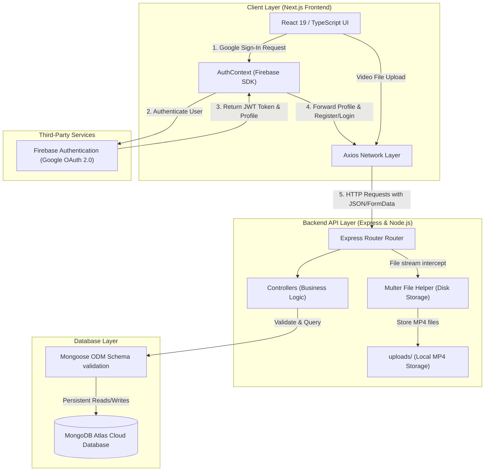

# YourTube 2.0: Technical Architecture & System Design Document

Welcome to **YourTube 2.0**, a production-grade, full-stack video hosting and streaming platform. Designed as a modern, high-performance clone of YouTube, this application leverages a hybrid architecture combining the **MERN (MongoDB, Express.js, React, Node.js) stack** with **Firebase Auth** for secure, seamless Google Single Sign-On (SSO).

This document details the engineering decisions, database schemas, component structures, API routing, and architectural trade-offs that power the platform. Use this as your primary engineering guide, portfolio showcase, or technical reference.

---

## 1. System Architecture Overview

YourTube 2.0 is built on a split-codebase model consisting of a headless, RESTful API backend and a client-side server-rendered Next.js frontend.



### Core Technologies

| Layer | Technology | Primary Purpose | Rationale |
| :--- | :--- | :--- | :--- |
| **Frontend** | **Next.js 15 (Pages Router)** | Client-side UI & page rendering | Combines static generation (SSG) with server-side rendering (SSR) for robust SEO and optimal user experiences. |
| **Styling** | **Tailwind CSS v4 & Radix UI** | Modern Design System | Enables hyper-customizable, beautiful interface components (via shadcn/ui primitives) with responsive, native-like utilities. |
| **Auth** | **Firebase client SDK** | Social Authentication / OAuth | Minimizes backend security surface area by delegating Google Login and state monitoring to a robust, compliant industry leader. |
| **Backend** | **Express.js (v5.x)** | REST API Gateway | Flexible, lightweight routing framework featuring high middleware extensibility. |
| **Database** | **MongoDB & Mongoose** | Document-oriented storage | Flexible schema design mapping perfectly to JSON-like documents representing videos, comments, and users. |
| **File Handling**| **Multer (Disk Storage)** | Multipart Form-Data parser | Specifically handles direct stream parsing of binary files (`video/mp4`) to the local server storage. |

---

## 2. Database Models & Schema Design

All data models are defined using **Mongoose Schemas** in the `server/Modals/` directory.

### 2.1 User Model (`server/Modals/Auth.js`)
Stores authenticated identity information and channel details. Created automatically upon the first successful Google authentication flow.

```javascript
const userschema = mongoose.Schema({
  email: { type: String, required: true },
  name: { type: String },
  channelname: { type: String },
  description: { type: String },
  image: { type: String },
  joinedon: { type: Date, default: Date.now },
});
```

### 2.2 Video Model (`server/Modals/video.js`)
Tracks hosted video assets, view counts, and engagement metrics.

> [!WARNING]
> **Schema Bug Found & Documented:**
> In the original schema definition below, the field `filename` was declared twice (Lines 5 and 7). Mongoose will simply override the duplicate key during compilations, but for strict engineering hygiene, one declaration should be omitted.

```javascript
const videochema = mongoose.Schema(
  {
    videotitle: { type: String, required: true },
    filename: { type: String, required: true }, // Duplicate 1
    filetype: { type: String, required: true },
    filename: { type: String, required: true }, // Duplicate 2 (Omit this in refactoring)
    filepath: { type: String, required: true },
    filesize: { type: String, required: true },
    videochanel: { type: String, required: true },
    Like: { type: Number, default: 0 },
    views: { type: Number, default: 0 },
    uploader: { type: String },
  },
  {
    timestamps: true,
  }
);
```

### 2.3 Comments Model (`server/Modals/comment.js`)
Models a multi-user commenting ecosystem on individual videos.

```javascript
const commentSchema = mongoose.Schema({
  videoid: { type: String, required: true },
  userid: { type: String, required: true },
  commentbody: { type: String, required: true },
  usercommented: { type: String, required: true },
  commentedon: { type: Date, default: Date.now },
});
```

### 2.4 History & Watch Later Models
- **History (`server/Modals/history.js`)**: Tracks user viewing activity to display the "Recently Watched" feed.
- **Watch Later (`server/Modals/watchlater.js`)**: A simplified relational list allowing users to bookmark media content.

---

## 3. Frontend Architecture (`yourtube`)

The Next.js client uses a modular component structure located inside `src/components` and coordinates pages via the standard `src/pages` route mapper.

### 3.1 Authentication Hook (`src/lib/AuthContext.js`)
Rather than forcing the frontend to constantly ping the backend database to check session states, the client relies on a **React Context-powered Observer Pattern** (`onAuthStateChanged`) provided by Firebase.

1. **Google Pop-Up Triggered**: `handlegooglesignin` calls Firebase `signInWithPopup`.
2. **Profile Interception**: The returned user payload (email, display name, photo URL) is structured.
3. **Synchronization**: An HTTP POST is sent to `/user/login`.
   - If the user is new, the backend inserts a new document in MongoDB.
   - If the user is returning, the database returns their user object.
4. **Local State Cache**: The synced database object is stored in the React context state (`user`) and mirrored in `localStorage` for page reload preservation.

### 3.2 Dynamic Routing and Video Playing (`src/pages/watch/[id]/index.tsx`)
This page handles routing based on video IDs using Next.js dynamics.
- When navigating to `/watch/6789abcde`, the router extracts the `id`.
- The frontend fetches all metadata, filters client-side for the target ID, and hooks the binary file location to the custom `<Videopplayer />`.
- `<Videopplayer />` leverages standard HTML5 media APIs, binding `BACKEND_URL` + the static `filepath` directly to the `<video>` element src.

---

## 4. Backend Architecture & Video Processing

The backend is built around standard REST guidelines. Uploads are parsed in chunks to avoid server RAM spikes.

### 4.1 Chunked Upload Pipeline with Multer
Uploading a high-resolution video file requires passing stream data in chunks using `multipart/form-data`. This is handled by a custom middleware file helper:

```javascript
// file:///home/rthik/projects/youtube/you_tube2.0/server/filehelper/filehelper.js
const storage = multer.diskStorage({
  destination: (req, res, cb) => {
    cb(null, "uploads"); // Destination folder
  },
  filename: (req, file, cb) => {
    cb(
      null,
      new Date().toISOString().replace(/:/g, "-") + "-" + file.originalname
    ); // Timestamp-prefixed to prevent namespace collisions
  },
});
const filefilter = (req, file, cb) => {
  if (file.mimetype === "video/mp4") {
    cb(null, true); // Strict validation
  } else {
    cb(null, false);
  }
};
const upload = multer({ storage: storage, fileFilter: filefilter });
```

### 4.2 Stream Serving Middleware
To allow the Next.js HTML5 `<video>` tag to read files without crashing, the backend configures Express Static middleware to serve physical files straight from disk:

```javascript
app.use("/uploads", express.static(path.join("uploads")));
```
Whenever the frontend requests `http://localhost:5000/uploads/2026-05-19T...-video.mp4`, Express routes it straight to the file system, enabling built-in support for HTTP range requests (allowing users to scrub forward/backward in the video timeline).

---

## 5. Engineering Decisions & Architectural Trade-offs

As a senior engineer reviewing this project, let's look at the underlying trade-offs and design philosophies:

### 1. Hybrid Auth (Firebase SDK + Custom MongoDB Sync)
- **Why**: Standard custom auth requires implementing password hashing, salting, email validation, token rotation, and password reset flows, which present extensive security liabilities. Delegating login to Google Auth via Firebase secures the authentication surface while a synchronous database check maintains clean relationship links inside MongoDB.
- **Trade-off**: Increases setup overhead by needing to synchronize client Firebase token status with a backend session context.

### 2. Local Disk Storage for Videos
- **Why**: Extremely simple to set up for local development, fast write speeds, and zero cost.
- **Trade-off**: **Not horizontally scalable**. If a second backend server instance is launched behind a load balancer, it won't have access to the local `uploads/` folder of the first server. Additionally, it consumes local hard drive space rapidly.
- *Recommended Production Upgrade*: Connect Multer to **AWS S3 / Google Cloud Storage** using `multer-s3` and serve streams through a global **CDN** (like CloudFront) or utilize a transcoding engine (like **Mux** or **AWS Elemental MediaConvert**) to break files into HLS (.m3u8) streams.

### 3. Client-Side Video Filtering
- **Why**: On the watch page (`src/pages/watch/[id]/index.tsx`), the client requests `getallvideo` and filters for the current ID.
- **Trade-off**: If the system contains thousands of videos, downloading the entire video list just to view a single video will destroy browser performance and balloon server bandwidth.
- *Recommended Production Upgrade*: Implement a dedicated endpoint on the backend:
  `routes.get("/get/:id", getvideoById)` and query MongoDB using `video.findById(req.params.id)`.

---

## 6. How to Run the Entire Project Locally

To launch your platform, run the backend server and frontend client concurrently:

### Prerequisites
Make sure you have **Node.js** (v18 or higher) and a running instance of **MongoDB** (local or MongoDB Atlas).

### 1. Start the Backend Server
1. Navigate to `/home/rthik/projects/youtube/you_tube2.0/server`.
2. Ensure you have a `.env` file containing:
   ```env
   PORT=5000
   DB_URL=your_mongodb_connection_string
   ```
3. Run:
   ```bash
   npm install
   npm run start
   ```
   The console will output: `server running on port 5000` and `Mongodb connected`.

### 2. Start the Next.js Frontend
1. Navigate to `/home/rthik/projects/youtube/you_tube2.0/yourtube`.
2. Ensure you have a `.env.local` containing:
   ```env
   BACKEND_URL=http://localhost:5000
   ```
3. Run:
   ```bash
   npm install
   npm run dev
   ```
4. Open your browser to `http://localhost:3000`.

---

## 7. Recommended Production Roadmap

To transform this portfolio project into a legendary enterprise application, implement these three upgrades:

1. **True HLS Streaming**: Compress and transcode raw MP4 files into HLS (HTTP Live Streaming) playlists with adaptive bitrate streams (240p, 480p, 720p, 1080p).
2. **Cloud Storage Engine**: Swap out local disk storage for an AWS S3 integration.
3. **Database Indexing**: Apply MongoDB database indexes on highly queried fields:
   ```javascript
   videochema.index({ uploader: 1 });
   commentSchema.index({ videoid: 1 });
   ```
